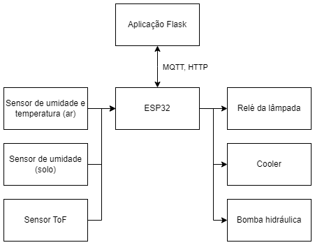

# MicrogreensFW

Main repository for the firmware of the Microgreens project, developed for the Internet of Things Project course (SEL0373).

## System Architecture and Basic Operation

### Process Flow

1. The user accesses the platform and selects the plant they want to cultivate from a predefined list. Based on this choice, the platform provides the user with basic plant care instructions.
2. The user plants the seeds, places the tray on top, and notifies the platform that the process has started.
3. The platform sends the plant cultivation data to the ESP32.
4. Once the process is complete, the ESP32 notifies the platform.
5. The platform informs the user that the process has been completed.
6. The user harvests the plant.

If any issues are detected, the user is notified.

### Processes Monitored and Controlled by the ESP32

- **Temperature** (monitored via sensor, controlled via ventilation)
- **Soil Moisture** (monitored via sensor, controlled via irrigation)
- **Plant Height** (monitored via ToF sensor)
- **Lighting** (controlled via LED)

## Board Used

Confidential.

## Materials

The list of materials (excluding the board) can be viewed in [this spreadsheet](https://docs.google.com/spreadsheets/d/1QAQEL1R4-6mjEcpoBJlASzv0y4lyy3VPI9GnsOz3ivg/edit#gid=0).

## Contributors

- Henrique Megid
- [Henrique Sander Lourenço](https://github.com/hsanderr)
- Tiago Xavier

## License

Copyright 2023 MicrogreensBR. Released under the [Apache 2.0 license](./LICENSE).
